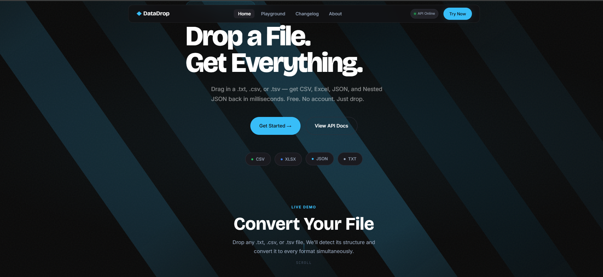
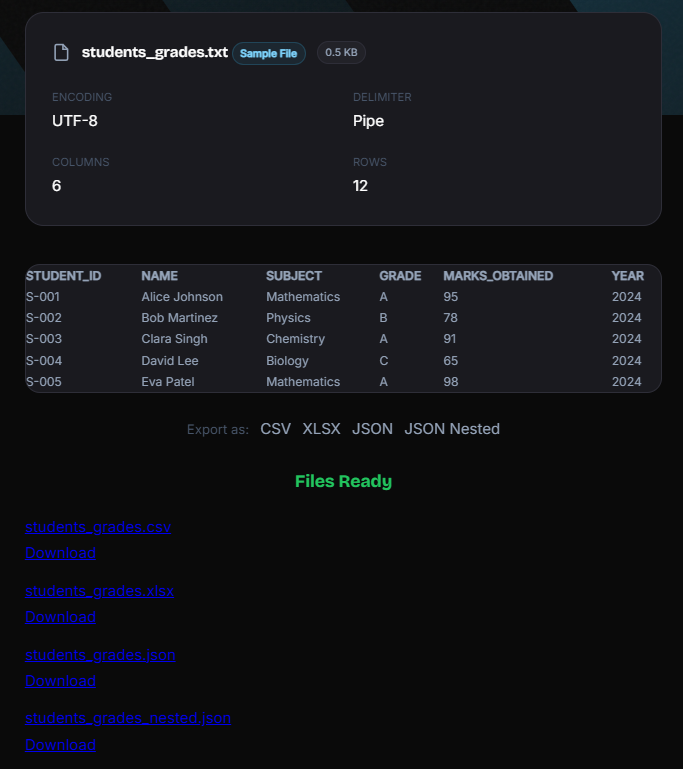

# DataDrop ◆

> **Drop a file. Get everything.**  
> A production-grade file conversion API — drop any `.txt`, `.csv`, or `.tsv` and receive CSV, Excel, JSON, and Nested JSON back in milliseconds.

<br>

## 🌐 Live Deployments

| Version                           | Design                                  | Stack          | URL                                                                                  |
| --------------------------------- | --------------------------------------- | -------------- | ------------------------------------------------------------------------------------ |
| **v2 — Surgical Dark** _(latest)_ | Dark Charcoal + Ice Blue, 12 animations | HTML/CSS/JS    | [datadrop-v2.vercel.app](https://datadrop-v2.vercel.app)                             |
| **v1 — Amber Dark**               | Dark + Amber, particle field            | HTML/CSS/JS    | [datadrop-sigma.vercel.app](https://datadrop-sigma.vercel.app)                       |
| **Backend API**                   | —                                       | Python + Flask | [text-csv-json-converter.onrender.com](https://text-csv-json-converter.onrender.com) |

<br>

## 📸 Screenshots

<p align="center">
  
  
</p>

<p align="center">
  <i>Home Page Interface &nbsp; | &nbsp; Conversion Workflow</i>
</p>

---

## 📁 Project Structure

```
text-csv-json-converter/
│
├── 📂 frontend/                  ← v1 Amber Dark (live on Vercel)
│   ├── index.html
│   ├── about.html
│   ├── changelog.html
│   └── playground.html
│
├── 📂 frontend1/                 ← v2 Surgical Dark (live on Vercel)
│   ├── index.html
│   ├── about.html
│   ├── changelog.html
│   ├── playground.html
│   └── assets/
│       └── tanish.jpeg
│
├── 📂 backend/
│   └── 📂 src/
│       ├── app.py               ← Flask server — 9 endpoints
│       ├── converter.py         ← Conversion engine
│       ├── security.py          ← OWASP security layer
│       ├── watcher.py           ← Folder drop automation
│       └── .env                 ← API keys (never committed)
│
├── 📂 data/
│   ├── 📂 raw/                  ← Uploaded files land here
│   ├── 📂 processed/            ← Converted outputs live here
│   └── 📂 samples/              ← 5 demo files served via API
│       ├── students_grades.txt
│       ├── employees.csv
│       ├── movies.txt
│       ├── products.tsv
│       └── weather_data.csv
│
├── requirements.txt
├── runtime.txt
├── Procfile                     ← Render deployment config
└── README.md
```

<br>

---

## ⚡ What It Does

```
YOU DROP THIS          →        YOU GET ALL OF THESE
─────────────────────────────────────────────────────
students.txt           →        students.csv
employees.csv          →        employees.xlsx
products.tsv           →        products.json
                       →        products_nested.json
```

One upload. Four outputs. Zero configuration.

<br>

---

## 🔌 API Endpoints — All 9

| Method | Endpoint                   | Description                                      | Rate Limit |
| ------ | -------------------------- | ------------------------------------------------ | ---------- |
| `POST` | `/upload`                  | Upload file → convert to all 4 formats           | 10 / min   |
| `POST` | `/preview`                 | Preview headers + first 5 rows before converting | 20 / min   |
| `GET`  | `/download/<filename>`     | Download a converted file by name                | 200 / day  |
| `GET`  | `/json-preview/<filename>` | View first 10 records of a JSON file inline      | 200 / day  |
| `GET`  | `/stats`                   | Live conversion statistics                       | 200 / day  |
| `GET`  | `/health`                  | API health check ping                            | No limit   |
| `GET`  | `/api-docs`                | Full machine-readable API documentation          | 200 / day  |
| `GET`  | `/samples`                 | List all available sample files                  | 200 / day  |
| `GET`  | `/samples/<filename>`      | Download a specific sample file                  | 200 / day  |

**Base URL:** `https://text-csv-json-converter.onrender.com`

<br>

### Quick Examples

```bash
# Convert a file — get back 4 download links
curl -X POST https://text-csv-json-converter.onrender.com/upload \
     -F 'file=@your_data.csv'

# Preview before committing
curl -X POST https://text-csv-json-converter.onrender.com/preview \
     -F 'file=@your_data.csv'

# Download converted output
curl -O https://text-csv-json-converter.onrender.com/download/your_data.json

# Health check
curl https://text-csv-json-converter.onrender.com/health
```

```javascript
// JavaScript — convert a file
const formData = new FormData();
formData.append("file", fileInput.files[0]);

const response = await fetch(
  "https://text-csv-json-converter.onrender.com/upload",
  {
    method: "POST",
    body: formData,
  },
);

const result = await response.json();
console.log(result.outputs);
// → ["data.csv", "data.xlsx", "data.json", "data_nested.json"]
```

<br>

---

## 🧠 How the Conversion Works

### The Delimiter Problem

Raw data files use different _separator characters_ (delimiters) to mark where one column ends and another begins. There is no universal standard — it depends on the tool that exported the file.

```
Comma-separated (CSV):     name,age,city
                           Alice,22,Mumbai

Tab-separated (TSV):       name    age    city
                           Alice   22     Mumbai

Pipe-separated (TXT):      name|age|city
                           Alice|22|Mumbai

Semicolon-separated:       name;age;city        ← Common in European Excel exports
                           Alice;22;Mumbai
```

### Auto-Detection Algorithm

DataDrop detects the delimiter automatically — you never configure anything.

```
INPUT FILE (first line only)
         │
         ▼
┌─────────────────────────────────────────────────┐
│  Count occurrences of each candidate            │
│                                                 │
│  candidates = [ '|', ',', '\t', ';' ]          │
│                                                 │
│  "name,age,city"  →  { '|':0, ',':2, '\t':0, ';':0 }
│                                                 │
│  max(counts, key=counts.get)  →  ','            │
└─────────────────────────────────────────────────┘
         │
         ▼
    DELIMITER = ','
```

**The actual function:**

```python
def detect_delimiter(first_line):
    candidates = ['|', ',', '\t', ';']

    counts = {}
    for char in candidates:
        counts[char] = first_line.count(char)
    #  counts = {'|': 0, ',': 2, '\t': 0, ';': 0}

    detected = max(counts, key=counts.get)
    #  max() with key=counts.get → finds key with highest VALUE
    #  result → ','

    if counts[detected] == 0:
        return '|'   # fallback if no delimiter found at all

    return detected
```

### Full Pipeline

```
RAW FILE (.txt / .csv / .tsv)
         │
         ▼
┌────────────────────┐
│  read_any_file()   │  Opens file once, calls detect_delimiter()
│                    │  Splits every line by detected delimiter
│                    │  Returns: list of lists (converted_data)
└────────────────────┘
         │
         ▼
┌────────────────────┐
│ check_header_row() │  Checks if first row is headers or data
│                    │  Heuristic: if every cell converts to float → it's data, not headers
│                    │  Returns: True (valid) / False (abort)
└────────────────────┘
         │
    ┌────┴────┐
    ▼         ▼
 valid      invalid → ERROR logged, conversion stops
    │
    ▼
┌──────────────────────────────────────────────┐
│  4 SIMULTANEOUS OUTPUTS                      │
│                                              │
│  convert_to_csv()         → data.csv         │
│  convert_to_excel()       → data.xlsx        │
│  convert_to_json_flat()   → data.json        │
│  convert_to_json_nested() → data_nested.json │
└──────────────────────────────────────────────┘
         │
         ▼
   All files saved to data/processed/
   Download links returned in API response
```

### The 4 Output Formats Explained

```
INPUT ROW:   Alice | 22 | Mumbai
             ─────────────────────────────────────────────

CSV          Alice,22,Mumbai                    ← Comma-separated, universal
             → Works in Google Sheets, Excel, databases, pandas

XLSX         [Native Excel file]                ← Binary Excel format
             → Opens directly in Microsoft Excel with formatting

JSON Flat    {"name":"Alice","age":"22",         ← Each row = one object
              "city":"Mumbai"}                    → Perfect for REST APIs, frontend

JSON Nested  {"Alice": {"age":"22",              ← Grouped by first column value
               "city":"Mumbai"}}                  → Hierarchical data, config files
```

<br>

---

## 🔐 Security Layer (OWASP)

Every request passes through `security.py` before touching the filesystem.

```
INCOMING REQUEST
       │
       ▼
┌──────────────────────────────────────────────────────┐
│  1. FILE EXTENSION CHECK                             │
│     Allowed: .txt .csv .tsv .json only               │
│     Blocked: .exe .sh .php .py and everything else   │
├──────────────────────────────────────────────────────┤
│  2. FILE SIZE CHECK                                  │
│     Maximum: 5MB                                     │
│     Prevents: DoS attacks via massive uploads        │
├──────────────────────────────────────────────────────┤
│  3. FILENAME SANITIZATION                            │
│     werkzeug.secure_filename() strips path chars     │
│     "../../../etc/passwd" → "passwd" (attack blocked)│
├──────────────────────────────────────────────────────┤
│  4. RATE LIMITING (Flask-Limiter)                    │
│     /upload  → 10 requests per minute per IP         │
│     /preview → 20 requests per minute per IP         │
│     Global   → 2000/day, 500/hour                    │
├──────────────────────────────────────────────────────┤
│  5. OWASP RESPONSE HEADERS (on every response)       │
│     X-Content-Type-Options: nosniff                  │
│     X-Frame-Options: DENY                            │
│     X-XSS-Protection: 1; mode=block                  │
├──────────────────────────────────────────────────────┤
│  6. API KEY — HMAC constant-time comparison          │
│     hmac.compare_digest() prevents timing attacks    │
│     Fail-closed: no key in .env = deny everything    │
└──────────────────────────────────────────────────────┘
       │
       ▼
  REQUEST APPROVED → passed to converter
```

<br>

---

## 👁️ File Watcher — Automated Pipeline

`watcher.py` watches a folder. You drop a file in. It converts automatically. No browser needed.

```
data/raw/           ←  Drop any file here
    │
    │  OS detects new file → notifies watchdog Observer
    ▼
┌──────────────────────────────┐
│  ConvertOnDrop (event handler)│
│                              │
│  1. Debounce (2s window)     │  ← prevents duplicate triggers on one save
│  2. Security validate        │  ← same checks as the API
│  3. Wait for copy to finish  │  ← polls file size until stable
│  4. Check extension          │  ← .txt .csv .tsv only
│  5. Run full conversion      │  ← calls all 4 convert functions
│  6. Log result               │
└──────────────────────────────┘
    │
    ▼
data/processed/     ←  All 4 output files appear here automatically
```

**Run the watcher:**

```bash
cd backend/src
python watcher.py
```

**Output:**

```
════════════════════════════════════════════════════════════
   FILE WATCHER STARTED
   Listening for drops in: ../data/raw
   Press Ctrl+C to stop.
════════════════════════════════════════════════════════════
[WATCHER] 🚨 TRIGGER FIRED: New file detected → data/raw/sales.csv
[WATCHER] ✅ File ready. Beginning conversion...
[WATCHER] 🎉 Auto-conversion successful for: sales
------------------------------------------------------------
```

<br>

---

## 🚀 Run Locally in VS Code

### Prerequisites

Make sure you have these installed:

| Tool   | Version | Check              |
| ------ | ------- | ------------------ |
| Python | 3.9+    | `python --version` |
| pip    | latest  | `pip --version`    |
| Git    | any     | `git --version`    |

<br>

### Step 1 — Clone the repo

```bash
git clone https://github.com/Tanish-30-08-2006/text-csv-json-converter.git
cd text-csv-json-converter
```

### Step 2 — Set up the Python environment

```bash
# Create a virtual environment (keeps dependencies isolated)
python -m venv venv

# Activate it
# Windows:
venv\Scripts\activate

# Mac/Linux:
source venv/bin/activate

# Install all dependencies
pip install -r requirements.txt
```

### Step 3 — Create the .env file

```bash
# Inside backend/src/ create a file called .env
# Add this line:
CONVERTER_API_KEY=your_secret_key_here
```

> ⚠️ Never commit `.env` to GitHub. It's already in `.gitignore`.

### Step 4 — Start the backend

```bash
cd backend/src
python app.py
```

You should see:

```
 * Running on http://0.0.0.0:5000
 * Debug mode: off
```

### Step 5 — Open the frontend

Open any of these files directly in your browser:

```
frontend1/index.html        ← v2 main page
frontend1/playground.html   ← API tester
frontend1/about.html        ← Developer info
frontend1/changelog.html    ← Version history
```

Or use VS Code's **Live Server** extension — right-click `index.html` → **Open with Live Server**.

> The frontend talks to the live Render API by default. To use your local backend, change `API_BASE` at the top of each HTML file's `<script>` tag from the Render URL to `http://localhost:5000`.

<br>

### Step 6 — (Optional) Run the file watcher

Open a second terminal:

```bash
cd backend/src
python watcher.py
```

Now drop any `.csv`, `.txt`, or `.tsv` into `data/raw/` and watch it convert automatically.

<br>

---

## 📦 Dependencies

```
flask==3.1.1              ← Web framework
flask-cors==5.0.1         ← Cross-origin request handling
flask-limiter==3.12.0     ← Rate limiting
pandas==2.2.3             ← DataFrame engine + Excel export
openpyxl==3.1.5           ← XLSX file writing (pandas dependency)
python-dotenv==1.1.0      ← .env file loading
watchdog==6.0.0           ← Folder monitoring
werkzeug==3.1.3           ← File sanitization utilities
gunicorn==23.0.0          ← Production WSGI server (Render)
```

<br>

---

## 🎨 Frontend v2 — Design System

Built from scratch. No frameworks. No templates.

```
COLORS
  Background:  #0C0C0E  (near-black charcoal)
  Cards:       #1A1A1F
  Accent:      #38BDF8  (ice blue)
  Text:        #F1F5F9  (near-white)
  Muted:       #94A3B8  (slate grey)

FONTS
  Headlines:   Bricolage Grotesque 800
  Body:        Inter 400/500
  Code:        JetBrains Mono

ANIMATIONS (12 total)
  A1  Page entrance stagger         A7  Upload zone drag pulse
  A2  Gradient mesh drift           A8  Conversion success burst
  A3  Word-by-word headline reveal  A9  Number scramble (stats)
  A4  Scroll reveal                 A10 Sliding nav pill
  A5  Card lift on hover            A11 Magnetic buttons
  A6  Spotlight torch effect        A12 Blinking cursor (code)

### Micro-Features
- **Status-Aware Favicon**: A theme-intelligent SVG icon that monitors API health (Green/Red) in real-time within the browser tab.
- **Integrated Sample Files**: 5 production-ready datasets (`students_grades`, `employees`, etc.) fetchable with a single click.
- **One-Click Loading**: Automatic blob-to-file injection and smooth-scrolling UX flow.
```

**Hero background:** Diagonal ice-blue light beams at -35° with film grain noise texture — inspired by Raycast.com.

<br>

---

## 🗺️ Deployment Architecture

```
                    ┌─────────────┐
                    │   GitHub    │
                    │  (dev branch)│
                    └──────┬──────┘
                           │
              ┌────────────┼────────────┐
              │                         │
              ▼                         ▼
   ┌─────────────────┐       ┌─────────────────┐
   │  Vercel (v1)    │       │  Vercel (v2)    │
   │  frontend/      │       │  frontend1/     │
   │  Amber Dark     │       │  Surgical Dark  │
   └─────────────────┘       └─────────────────┘
              │                         │
              └────────────┬────────────┘
                           │
                           ▼ API calls
                  ┌─────────────────┐
                  │  Render         │
                  │  backend/src/   │
                  │  Flask + Gunicorn│
                  │  9 endpoints    │
                  └─────────────────┘
                           │
                           ▼
                  ┌─────────────────┐
                  │  data/          │
                  │  ├── raw/       │
                  │  ├── processed/ │
                  │  └── samples/   │
                  └─────────────────┘
```

<br>

---

## 📊 Conversion Stats

Live stats available at `/stats` endpoint. Updated after every conversion.

| Metric          | Endpoint                         | Description                                      |
| --------------- | -------------------------------- | ------------------------------------------------ |
| Files Converted | `/stats` → `files_converted`     | Rolling total since deployment                   |
| Avg Speed       | `/stats` → `processing_speed_ms` | Rolling average ms per conversion                |
| Formats         | `/stats` → `formats_supported`   | Always 6: TXT, CSV, TSV, XLSX, JSON, Nested JSON |

<br>

---

## 🔄 Changelog

| Version  | Date       | Highlights                                                      |
| -------- | ---------- | --------------------------------------------------------------- |
| **v1.3** | March 2026 | Frontend v2 surgical dark redesign, 12 animations, file watcher |
| **v1.2** | March 2026 | `/preview`, `/json-preview`, `/api-docs`, `/samples` endpoints  |
| **v1.1** | March 2026 | Render deployment, OWASP security, rate limiting                |
| **v1.0** | March 2026 | `converter.py`, `watcher.py`, 4 core endpoints                  |

<br>

---

## 👤 Developer

**Tanish Sanghavi**  
B.Tech @ DAIICT, Gandhinagar · Explorer

| Platform  | Link                                                               |
| --------- | ------------------------------------------------------------------ |
| GitHub    | [@Tanish-30-08-2006](https://github.com/Tanish-30-08-2006)         |
| Instagram | [@tanish\_\_sanghavi](https://www.instagram.com/tanish__sanghavi/) |
| Email     | tanishsanghavi2@gmail.com                                          |

<br>

---

## 📄 License

MIT — use it, fork it, build on it.

---

<div align="center">

**DataDrop v1.3** · Developer - Tanish Sanghavi- Built with Python Flask · 2026

[v2 Live Site](https://datadrop-v2.vercel.app) · [v1 Live Site](https://datadrop-sigma.vercel.app) · [API](https://text-csv-json-converter.onrender.com/health)

</div>
